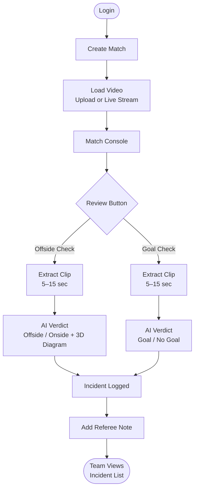

# Atletico Intelligence -- AI-Powered Soccer 
Incident Review

## Project Structure

```text
folder_name/
├─ docker-compose.yml
├─ README.md
├─ backend/
│  ├─ main.py
│  ├─ requirements.txt
│  ├─ Dockerfile
│  └─ data_store.json          # created at runtime
└─ frontend/
   ├─ index.html
   ├─ app.js
   ├─ styles.css
   └─ Dockerfile
```

## What this demo covers

- Dark UI aligned to provided mockup style (sidebar + topbar + role-specific screens)
- Login flow with mock roles (`League Admin`, `Match Official`, `Team Viewer`)
- Role-based permissions (viewer is read-only)
- Match setup panel (match id + source mode) inside Live Console flow
- Match console with `Offside Check` and `Goal Check`
- Goal auto-detect trigger (prototype simulation)
- Offside secondary frame review action
- Playable incident clip in detail view with scrubber
- In-detail `Review This Frame` control for offside
- Live video preview panel and timeline scrubber in Live Console
- Visual evidence placeholders for offside (3D positional) and goal (goal-line overlay)
- Simulated processing timeline (`queued -> extracting_clip -> ai_analyzing -> completed`)
- Incident list and incident detail panel
- Referee notes (300-char limit + basic profanity blocking)
- Clip delete action while preserving incident metadata
- Clip download endpoint (mock signed URL)
- Team isolation via `X-Team-Id` context in backend checks
- Single in-flight review lock per match
- Lightweight persistence to local JSON store so data survives restart

## Run backend

```bash
cd prototype/backend
pip install -r requirements.txt
uvicorn main:app --reload
```

Backend runs at `http://127.0.0.1:8000`.

## Run frontend

Serve `prototype/frontend` with any static server.
Example:

```bash
cd prototype/frontend
python -m http.server 5500
```

Open `http://127.0.0.1:5500`.

## Run with Docker (recommended)

From `prototype` folder:

```bash
docker compose up --build -d
```

Then open:
- Frontend: `http://127.0.0.1:5500`
- Backend health: `http://127.0.0.1:8000/health`

Stop:

```bash
docker compose down
```

## Demo sequence

1. Login as `Match Official`
2. Confirm match setup values
3. Trigger offside or goal checks
4. Open an incident, edit note, and optionally delete clip
5. Login as `Team Viewer` to verify read-only mode

## BRD-complete prototype notes

- Live stream ingest, CV model inference, and real 3D rendering are represented as simulated steps in this prototype.
- Full production behavior is documented in `TECHNICAL_SCOPE_AND_PLAN.md`.
- A full mock compliance checker is available at `backend/mock_ai_functionality_check.py` to validate role permissions, incident flows, notes, download/delete behavior, live source transitions, and team isolation.

## Run automated mock functionality check

1. Start backend (`uvicorn main:app --reload`) from `prototype/backend`.
2. Ensure `prototype/test.mp4` exists (used as upload sample).
3. Run:

```bash
cd prototype/backend
python mock_ai_functionality_check.py
```

The script prints `PASS/FAIL` per functionality and exits non-zero if any check fails.

## System Architecture / User Flow


